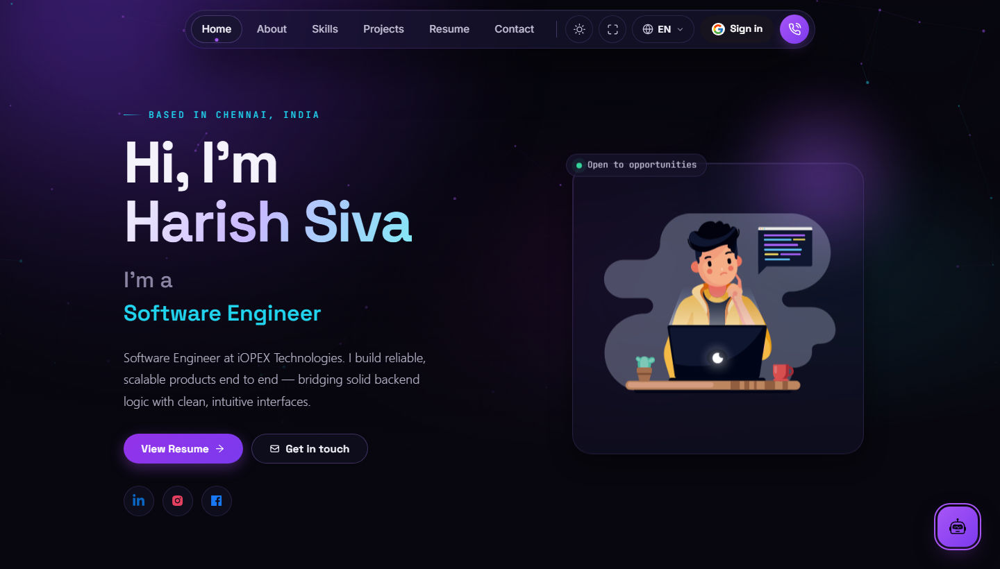
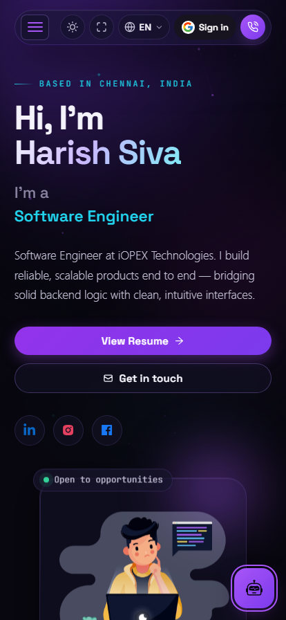

<h1 align="center">
  Harish Siva — Portfolio Website
</h1>

<p align="center">
  A personal portfolio showcasing my work, skills, and resume — designed with a modern aurora / glassmorphism aesthetic.
</p>

<div align="center">
  
  <br /><br />
  
</div>

<p align="center">
  <a href="https://harishportfolio.lovestoblog.com/" target="_blank"><strong>🌐 Live Site</strong></a>
</p>

---

## ✨ Features

- **Multi-page layout** — Home, About, Skills, and Resume pages powered by React Router
- **Animated hero section** — typewriter role effect, Lottie animations, and social links
- **Aurora backdrop** — fixed, GPU-friendly gradient-mesh background with glassmorphism cards
- **Skills showcase** — tech stack and tools rendered as an icon grid (JavaScript, TypeScript, PHP, CodeIgniter, Node.js, Nest.js, React, Next.js, SQL, and more)
- **In-browser resume** — PDF rendered directly on the page via `react-pdf`, with a download button
- **Fully responsive** — works across desktop, tablet, and mobile
- **Accessibility-aware** — respects `prefers-reduced-motion` and uses ARIA labels on interactive elements
- **Preloader & scroll restoration** — smooth page transitions with scroll-to-top on navigation

## 🛠️ Built With

| Category | Technology |
|---|---|
| Framework | [React 17](https://reactjs.org/) (Create React App) |
| Routing | [React Router v6](https://reactrouter.com/) |
| UI | [React Bootstrap 2](https://react-bootstrap.github.io/) + custom CSS |
| Animations | [lottie-react](https://www.npmjs.com/package/lottie-react), [typewriter-effect](https://www.npmjs.com/package/typewriter-effect), [react-parallax-tilt](https://www.npmjs.com/package/react-parallax-tilt) |
| PDF Viewer | [react-pdf](https://www.npmjs.com/package/react-pdf) |
| Icons | [react-icons](https://react-icons.github.io/react-icons/) |
| HTTP Client | [axios](https://axios-http.com/) |

## 📂 Project Structure

```
Portfolio-master/
├── public/                  # Static assets, favicons, manifest, index.html
├── src/
│   ├── Assets/              # Images, SVG tech icons, Lottie JSON, resume PDF
│   ├── components/
│   │   ├── Home/            # Hero, intro, and typewriter components
│   │   ├── About/           # About card, tech stack, tool stack
│   │   ├── Projects/        # Skills page (tech + tools showcase)
│   │   ├── Resume/          # PDF resume viewer
│   │   ├── helper/          # Aurora backdrop, Lottie wrapper
│   │   ├── Navbar.js        # Fixed responsive navigation
│   │   ├── Footer.js        # Footer with social links
│   │   ├── Pre.js           # Preloader
│   │   └── ScrollToTop.js   # Scroll restoration on route change
│   ├── services/            # Axios API client
│   ├── App.js               # Routes and app shell
│   ├── style.css            # Design system (aurora, glass, layout)
│   └── index.js             # Entry point
└── package.json
```

## 🚀 Getting Started

### Prerequisites

- [Node.js](https://nodejs.org/) (v14 or later recommended)
- npm (comes with Node.js)

### Installation

1. Clone the repository:

   ```bash
   git clone <repository-url>
   cd Portfolio-master
   ```

2. Install dependencies:

   ```bash
   npm install
   ```

3. Start the development server:

   ```bash
   npm start
   ```

   The app runs at [http://localhost:3000](http://localhost:3000) and reloads on edits.

### Building for Production

```bash
npm run build
```

Outputs an optimized production build to the `build/` folder, ready to deploy on any static host.

### Running Tests

```bash
npm test
```

## 🎨 Customization

All content lives in `src/components/`:

| What to change | Where |
|---|---|
| Hero name, tagline, social links | `src/components/Home/Home.js` |
| Typewriter roles | `src/components/Home/Type.js` |
| About text & interests | `src/components/About/AboutCard.js` |
| Tech stack icons | `src/components/About/Techstack.js` |
| Tools icons | `src/components/About/Toolstack.js` |
| Resume PDF | Replace `src/Assets/harish_resume_new.pdf` |
| Colors & design tokens | `src/style.css` |

## 📄 Pages

| Route | Description |
|---|---|
| `/` | Hero, introduction, and social connect section |
| `/about` | Background, education, and interests |
| `/skills` | Professional skillset and tools |
| `/resume` | Embedded resume viewer with download |

## 🙏 Credits

Based on the open-source portfolio template by [Soumyajit Behera](https://github.com/soumyajit4419/Portfolio), heavily customized with a redesigned UI, aurora backdrop, and updated content.

## 📬 Contact

- **LinkedIn:** [Harish S](https://www.linkedin.com/in/harish-s-119b5a18a/)
- **Location:** Chennai, India

---

<p align="center">
  Designed &amp; built by <strong>Harish Siva</strong> · Give a ⭐ if you like it!
</p>
